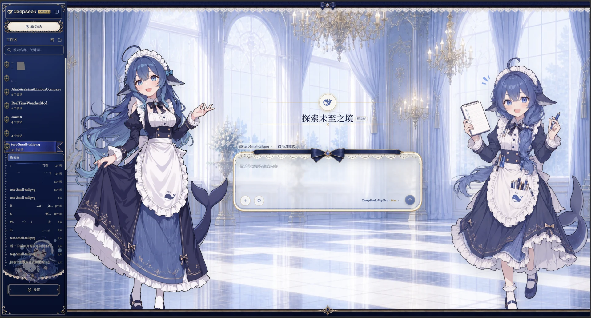

# 🐳 DeepSeek Harness 鲸鱼娘皮肤启动器

DeepSeek Harness Web GUI 的**鲸鱼娘皮肤一键启动器**（maid-atelier · 深海女仆工坊）。

| 亮色模式 | 暗色模式 |
|---|---|
|  |  |

双女仆工坊场景对话背景（亮/暗自动切换）、深海蓝蕾丝 UI 覆盖层、Q 版侧栏角色。启动后打开 `http://127.0.0.1:3080` 即可看到。

## 📦 包含内容

- **`启动鲸鱼娘皮肤.bat`** — 一键把皮肤装进 `web` profile 并启动 `dsh web`
- **`maid-atelier/`** — 皮肤本体（含预构建 `lib/`，激活不依赖远程资源）
- **`scripts/ensure-skin.ps1`** — 幂等安装皮肤到 web profile
- **`scripts/make-desktop-shortcut.ps1`** — 创建带鲸鱼娘大头图标的桌面快捷方式
- **`restart-gui.ps1`** — 重启辅助脚本（自动杀掉占用 3080 的旧进程后重启）
- **`maid-icon.ico`** — 桌面图标

## ✅ 前置条件

1. **DeepSeek Harness（dsh）已安装** — 参考 [pipykarchu/deepseek-harness](https://github.com/pipykarchu/deepseek-harness)
2. 启动器自动探测以下 harness 路径（也可用环境变量 `DSH_HARNESS` 指定）：
   - `D:\DEEPSEEK harness\deepseek-harness`
   - `D:\AI\deepseek\deepseek-harness`
3. Node 环境：自动探测 `D:\DEEPSEEK harness\node`、`D:\chajian`（或 `DSH_NODE_DIR` 指定，否则走 PATH）
4. `pnpm` 在 PATH 上
5. `DSH_HOME` 缺省为 `%USERPROFILE%\.dsh`，可用环境变量覆盖

## 🚀 快速开始

1. **双击 `启动鲸鱼娘皮肤.bat`**
2. 首次运行会自动把 `maid-atelier` 装进 `web` profile（`dsh plugin --profile web add`，幂等），之后每次启动自检
3. 启动 `dsh web` 后浏览器打开 <http://127.0.0.1:3080>，**关闭窗口即停止服务**

### （可选）桌面快捷方式

```powershell
powershell -ExecutionPolicy Bypass -File scripts\make-desktop-shortcut.ps1
```

生成带鲸鱼娘大头图标的「DeepSeek Harness 鲸鱼娘」快捷方式。

## 🗑️ 卸载皮肤

在 harness 目录执行：

```sh
pnpm dsh plugin --profile web remove @dsh-external/dsh-client-ui-skin-maid-atelier
```

重启 `dsh web` 即完全复原。

## 🔧 故障排查

| 症状 | 原因 | 解决 |
|---|---|---|
| 启动报 `[ERR_PNPM_NO_PKG_MANIFEST] No package.json found in <某目录>` | bat 里的 `setlocal` 在 `chcp 65001` 下会让 pnpm 认错工作目录（已修复移除） | 本版本已修复，无需操作 |
| 启动器找不到 harness | 路径不在默认列表 | 设置环境变量 `DSH_HARNESS` 指向 harness 根目录 |
| 端口 3080 被占用 | 上一次服务未退出 | 双击 `restart-gui.ps1` 或手动结束占用 3080 的进程 |

## 📄 许可与署名

皮肤为**衍生创作**，整体以 **CC BY-NC-SA 4.0**（署名-非商业性使用-相同方式共享）发布，**禁止商业性使用**。署名链（详见 `maid-atelier/NOTICE`）：

1. **上善** — 鲸鱼娘角色形象原作（[Pixiv](https://www.pixiv.net/users/62155430) · [Bilibili：上善无形](https://b23.tv/8h5L4xz)）
2. **ZipZipPipe** — 加入 DeepSeek 元素的二创设计（[Pixiv](https://www.pixiv.net/users/18604994) · [Bilibili](https://b23.tv/Pnw6nG8)）
3. **Small-tailqwq** — 皮肤工程与 DeepSeek 元素再设计（[dsh-deep-whale](https://github.com/Small-tailqwq/dsh-deep-whale)）

启动器脚本与图标为本仓库自产内容，同样以 CC BY-NC-SA 4.0 发布。
